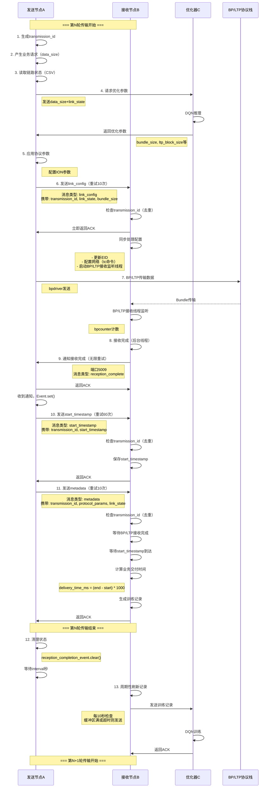

# BP/LTP 自适应传输系统 - 完整流程文档

## 📋 目录
- [系统架构](#系统架构)
- [完整传输流程](#完整传输流程)
- [消息类型详解](#消息类型详解)
- [关键机制](#关键机制)
- [API参考](#api参考)
- [状态管理](#状态管理)

---

## 🏗️ 系统架构

### 三节点架构
```
┌─────────────────┐         ┌─────────────────┐         ┌─────────────────┐
│  发送节点 A     │         │  接收节点 B     │         │  优化器 C       │
│  (Sender)       │◄───────►│  (Receiver)     │◄───────►│  (Optimizer)    │
│                 │  数据流  │                 │  训练记录│                 │
│ 192.168.137.194 │         │ 192.168.137.164 │         │ 192.168.137.1   │
└─────────────────┘         └─────────────────┘         └─────────────────┘
     │                            │
     │  端口5009（通知监听）       │  端口5001（数据接收）
     │  BP/LTP传输                │  BP/LTP接收
     └────────────────────────────┘
```

### 组件功能
- **发送节点A**：产生业务请求，请求优化参数，配置并发送BP/LTP数据
- **接收节点B**：接收BP/LTP数据，计算业务交付时间，生成训练记录
- **优化器C**：接收训练记录，使用DQN算法优化协议参数

---

## 🔄 完整传输流程

### 流程图（Mermaid）



---

## 📬 消息类型详解

### 1. link_config（链路配置）

**方向**：发送节点A → 接收节点B
**端口**：5001
**重试**：最多10次，指数退避（1s → 2s → 4s → 10s）

**消息结构**：
```json
{
  "type": "link_config",
  "transmission_id": "1771306538473_0",
  "data_size": 1000,
  "bundle_size": 30000,
  "link_state": {
    "bit_error_rate": 1e-5,
    "delay_ms": 100.0,
    "transmission_rate_mbps": 10.0,
    "sequence": 2
  },
  "dest_addr": "192.168.137.194",
  "sequence": 2,
  "timestamp": 1771306538.473
}
```

**作用**：
- 通知接收端准备接收
- 同步链路状态参数
- 配置接收端网络环境（tc命令）
- 更新接收端EID
- 启动BP/LTP接收监听线程

**接收端处理**：
1. 快速发送ACK（避免超时）
2. 检查transmission_id（去重）
3. 同步处理配置（单线程）
4. 更新EID：`ipn:sequence.2`
5. 调用`configure_network()`配置tc
6. 启动`_bp_ltp_reception_thread()`
7. 记录transmission_id到`processed_transmissions`

---

### 2. reception_complete（接收完成通知）

**方向**：接收节点B → 发送节点A
**端口**：5009
**重试**：无限重试，指数退避（1s → 2s → 4s → ... → 30s）

**消息结构**：
```json
{
  "type": "reception_complete",
  "timestamp": 1771306539.043
}
```

**作用**：
- 通知发送端BP/LTP数据已接收完成
- 触发发送端继续后续流程

**发送端处理**：
1. 通知监听器线程接收消息
2. 解析JSON，检查type
3. 设置`reception_completion_event`
4. 发送ACK响应
5. 主线程等待的`wait_for_reception_completion()`返回True

---

### 3. start_timestamp（开始时间戳）

**方向**：发送节点A → 接收节点B
**端口**：5001
**重试**：最多60次，指数退避（1s → 2s → 4s → ... → 60s）

**消息结构**：
```json
{
  "type": "start_timestamp",
  "transmission_id": "1771306538473_0",
  "start_timestamp": 1771306538.473859,
  "data_size": 1000
}
```

**作用**：
- 传递BP/LTP实际发送时间戳
- 用于计算业务交付时间

**接收端处理**：
1. 检查transmission_id（去重）
2. 调用`handle_data_transmission()`
3. 保存到`current_transmission["start_timestamp"]`
4. 设置`start_timestamp_received_event`
5. 发送ACK

**注意**：此消息类型不接收数据负载，只有JSON头部

---

### 4. metadata（传输元数据）

**方向**：发送节点A → 接收节点B
**端口**：5001
**重试**：最多10次，指数退避（1s → 2s → 4s → 10s）

**消息结构**：
```json
{
  "type": "metadata",
  "transmission_id": "1771306538473_0",
  "data_size": 1000,
  "link_state": {
    "bit_error_rate": 1e-5,
    "delay_ms": 100.0,
    "transmission_rate_mbps": 10.0,
    "sequence": 2
  },
  "protocol_params": {
    "bundle_size": 30000,
    "ltp_block_size": 300000,
    "ltp_segment_size": 600,
    "session_count": 4
  },
  "timestamp": 1771306540.123
}
```

**作用**：
- 触发业务交付时间计算
- 生成训练记录
- 保存到CSV文件

**接收端处理**：
1. 检查transmission_id（去重）
2. 调用`handle_metadata()`
3. 等待`reception_event`（BP/LTP接收完成）
4. 等待`start_timestamp_received_event`（时间戳到达）
5. 计算：`delivery_time_ms = (end - start) * 1000`
6. 调用`logger.record_transmission()`生成记录
7. 发送ACK

---

### 5. training_records（训练记录）

**方向**：接收节点B → 优化器C
**端口**：5003
**触发**：缓冲区满（100条）或超时（6000秒）

**消息结构**：
```json
{
  "type": "training_records",
  "count": 10,
  "records": [
    {
      "input": {
        "data_size": 1000,
        "bit_error_rate": 1e-5,
        "delay_ms": 100.0,
        "transmission_rate_mbps": 10.0
      },
      "output": {
        "bundle_size": 30000,
        "ltp_block_size": 300000,
        "ltp_segment_size": 600,
        "session_count": 4
      },
      "performance": {
        "delivery_time_ms": 569.311
      },
      "timestamp": 1771306540.123
    }
  ],
  "timestamp": 1771306540.456
}
```

**作用**：
- 向优化器提供训练数据
- 用于DQN算法学习

---

## ⚙️ 关键机制

### 1. 消息去重机制

**目的**：确保每个消息只被处理一次，避免重复处理

**实现**：
```python
# 发送端
self.current_transmission_id = f"{int(time.time() * 1000)}_{self.config_index}"

# 接收端
self.processed_transmissions = set()  # 保留最近100个ID

# 检查重复
if transmission_id and transmission_id in self.processed_transmissions:
    client_socket.sendall(b"OK_ALREADY_PROCESSED")
    return
```

**流程**：
1. 发送端为每轮传输生成唯一ID：`timestamp_毫秒_配置索引`
2. 所有消息携带`transmission_id`字段
3. 接收端维护已处理ID集合（最多100个）
4. 收到消息时先检查ID
5. 如果已处理，立即返回`OK_ALREADY_PROCESSED`
6. 否则正常处理，处理成功后记录ID

**优势**：
- ✅ 避免重复处理耗时操作
- ✅ 快速响应重复消息（<1ms）
- ✅ 内存可控（只保留100个ID）

---

### 2. 重试机制

**目的**：确保关键消息一定能被对方接收

#### 发送端重试策略

| 消息类型 | 最大重试次数 | 初始退避 | 最大退避 | 策略 |
|---------|------------|---------|---------|------|
| link_config | 10次 | 1s | 10s | 指数退避 + 随机抖动 |
| start_timestamp | 60次 | 1s | 60s | 指数退避 + 随机抖动 |
| metadata | 10次 | 1s | 10s | 指数退避 + 随机抖动 |

#### 接收端重试策略

| 消息类型 | 最大重试次数 | 初始退避 | 最大退避 | 策略 |
|---------|------------|---------|---------|------|
| reception_complete | 无限 | 1s | 30s | 指数退避 + 随机抖动 |

**指数退避公式**：
```python
sleep_time = min(max_backoff, backoff * 2) + random.uniform(0, 0.5)
```

**退避序列示例**：
```
第1次失败 → 等待 ~1.2s
第2次失败 → 等待 ~2.3s
第3次失败 → 等待 ~4.1s
第4次失败 → 等待 ~8.4s
第5次失败 → 等待 ~10.2s（已达最大）
```

---

### 3. 单线程顺序执行

**目的**：确保一轮传输完全结束后再开始下一轮

**发送端流程**：
```
while True:
    1. run_transmission_cycle()  # 单轮传输（阻塞）
        - 生成transmission_id
        - 请求优化参数（阻塞）
        - 发送link_config（阻塞重试）
        - BP/LTP传输
        - 等待reception_complete（阻塞）
        - 发送start_timestamp（阻塞重试）
        - 发送metadata（阻塞重试）
        - 清理状态
    2. sleep(interval)
    3. 继续下一轮
```

**接收端流程**：
```
while True:
    client_socket = server_socket.accept()
    handle_client(client_socket)  # 在主线程中同步处理
    # 处理完成后才accept下一个连接
```

**保留的后台线程**：
- ✅ 通知监听器线程（发送端）- 接收reception_complete
- ✅ BP/LTP接收监听线程（接收端）- 阻塞等待bpcounter
- ✅ 记录刷新线程（接收端）- 周期性发送训练记录

---

### 4. 状态清理

**发送端清理时机**：
```python
# 每轮传输开始前
def transmit_data():
    self.reception_completion_event.clear()  # 清理Event

# 每轮传输结束后（finally块）
def run_transmission_cycle():
    finally:
        self.reception_completion_event.clear()
```

**接收端清理时机**：
```python
# 收到link_config时
def handle_link_config():
    self.start_timestamp_received_event.clear()
    self.reception_event.clear()
    self.reception_result = {...}  # 重置
    self.current_transmission = {...}  # 重置
```

---

## 🔧 API参考

### 发送节点A (SenderNode)

#### 核心方法

| 方法名 | 参数 | 返回值 | 作用 |
|-------|------|-------|------|
| `run_transmission_cycle()` | 无 | 无 | 执行一次完整的传输周期 |
| `generate_business_request()` | 无 | `int` | 产生业务请求，返回数据大小 |
| `get_link_state()` | 无 | `Dict` | 从CSV读取链路状态 |
| `request_optimized_params()` | `data_size`, `link_state` | `Dict` | 向优化器请求参数 |
| `apply_protocol_params()` | `params`, `link_state`, `data_size` | 无 | 应用协议参数到ION |
| `send_link_config_to_receiver()` | `data_size`, `link_state`, `max_attempts=10` | `bool` | 发送链路配置（重试） |
| `transmit_data()` | `data_size`, `link_state` | `(float, bool)` | BP/LTP传输数据 |
| `wait_for_reception_completion()` | `timeout=300` | `bool` | 等待接收完成通知 |
| `send_start_timestamp_to_receiver()` | `start_timestamp`, `data_size`, `max_attempts=60` | `bool` | 发送时间戳（重试） |
| `send_metadata()` | `data_size`, `link_state`, `max_attempts=10` | `bool` | 发送元数据（重试） |

#### 通知监听器方法

| 方法名 | 作用 |
|-------|------|
| `start_notification_listener()` | 启动通知监听线程（端口5009） |
| `_notification_listener_worker()` | 监听线程工作函数 |

---

### 接收节点B (ReceiverNode)

#### 核心方法

| 方法名 | 参数 | 返回值 | 作用 |
|-------|------|-------|------|
| `handle_client()` | `client_socket`, `client_address` | 无 | 处理单个客户端连接（主流程） |
| `handle_link_config()` | `data: Dict` | `bool` | 处理链路配置请求 |
| `handle_data_transmission()` | `data: Dict` | `bool` | 处理数据传输请求（时间戳） |
| `handle_metadata()` | `data: Dict` | `bool` | 处理元数据请求，计算业务交付时间 |
| `notify_sender_reception_complete()` | 无 | `bool` | 通知发送端接收完成（无限重试） |
| `start_bp_ltp_reception()` | `data_size`, `bundle_size` | `bool` | 启动BP/LTP接收监听线程 |
| `_bp_ltp_reception_thread()` | `bundle_count` | 无 | BP/LTP接收监听线程工作函数 |
| `send_records_to_optimizer()` | `records: List` | `bool` | 发送训练记录到优化器 |
| `record_flusher_thread()` | 无 | 无 | 记录刷新线程工作函数 |

---

### 记录器 (RecordLogger)

| 方法名 | 参数 | 作用 |
|-------|------|------|
| `record_transmission()` | `data_size`, `bit_error_rate`, `delay_ms`, `transmission_rate_mbps`, `bundle_size`, `ltp_block_size`, `ltp_segment_size`, `session_count`, `delivery_time_ms` | 记录一次传输 |
| `add_record()` | `record: Dict` | 添加记录到缓冲区 |
| `_save_to_csv()` | `record: Dict` | 同步保存到CSV文件 |
| `should_flush()` | 无 | 检查是否需要刷新 |
| `get_records_to_send()` | 无 | 获取待发送记录 |

---

### BP/LTP接口 (BPLTPInterface)

#### 发送端接口

| 方法名 | 参数 | 作用 |
|-------|------|------|
| `update_destination_sequence()` | `sequence: int` | 更新目标EID后缀 |
| `setup_transmission_contact()` | `transmission_rate: float` | 设置传输contact |
| `transmit_data_via_bp_ltp()` | `data_size`, `transmission_rate_mbps` | 通过BP/LTP发送数据 |
| `configure_link_parameters()` | `bit_error_rate`, `delay_ms`, `transmission_rate_mbps`, `data_size` | 配置链路参数 |
| `apply_protocol_parameters()` | `bundle_size`, `ltp_block_size`, `ltp_segment_size`, `session_count`, `data_size`, `delay_ms`, `transmission_rate_mbps` | 应用协议参数 |

#### 接收端接口

| 方法名 | 参数 | 作用 |
|-------|------|------|
| `update_eid()` | `sequence: int` | 更新自己的EID |
| `configure_network()` | `dest_addr`, `bandwidth`, `tx_delay`, `loss_rate` | 配置网络（tc命令） |
| `calculate_bundle_count()` | `data_size`, `bundle_size` | 计算预期bundle数量 |
| `monitor_reception()` | `bundle_count` | 监听接收（bpcounter） |
| `parse_bpcounter_report()` | `report: str` | 解析bpcounter输出 |

---

## 📊 状态管理

### 发送端状态

| 状态变量 | 类型 | 作用 |
|---------|------|------|
| `current_transmission_id` | `str` | 当前传输的唯一ID |
| `reception_completion_event` | `threading.Event` | 接收完成事件 |
| `protocol_params` | `Dict` | 当前协议参数 |
| `config_index` | `int` | CSV配置索引 |
| `notification_listener_running` | `bool` | 通知监听器运行状态 |

### 接收端状态

| 状态变量 | 类型 | 作用 |
|---------|------|------|
| `processed_transmissions` | `set` | 已处理的transmission_id集合 |
| `current_transmission` | `Dict` | 当前传输的元数据 |
| `reception_event` | `threading.Event` | BP/LTP接收完成事件 |
| `start_timestamp_received_event` | `threading.Event` | 时间戳接收事件 |
| `reception_result` | `Dict` | BP/LTP接收结果 |
| `link_config_lock` | `threading.Lock` | 链路配置锁 |

---

## 🔍 关键时序

### 时间戳流转

```
发送端bpdriver执行时间 → bp_send_time
    ↓
发送端通过start_timestamp消息发送 → start_timestamp
    ↓
接收端保存 → current_transmission["start_timestamp"]
    ↓
接收端bpcounter停止时间 → stop_time
    ↓
接收端计算 → delivery_time_ms = (stop_time - start_timestamp) * 1000
```

### Event同步流转

**发送端**：
```
transmit_data() 开始
    ↓
清理 reception_completion_event.clear()
    ↓
BP/LTP传输完成
    ↓
wait_for_reception_completion(timeout=3000)
    ↓
通知监听器收到消息 → reception_completion_event.set()
    ↓
wait_for_reception_completion() 返回 True
```

**接收端**：
```
handle_link_config()
    ↓
清理 reception_event.clear()
清理 start_timestamp_received_event.clear()
    ↓
启动 _bp_ltp_reception_thread()
    ↓
[并行] bpcounter监听...
    ↓
[并行] 接收完成 → reception_event.set()
    ↓
handle_metadata()
    ↓
等待 reception_event.wait(timeout=6000)
等待 start_timestamp_received_event.wait(timeout=60)
    ↓
计算业务交付时间
```

---

## 📝 配置文件

### network_config.csv

CSV文件用于配置每轮传输的链路参数：

```csv
sequence,data_size_bytes,bit_error_rate,delay_ms,transmission_rate_mbps,description
2,1000,1e-5,100,10.0,良好链路条件
3,2000,1e-4,200,5.0,中等链路条件
4,5000,1e-3,500,1.0,恶劣链路条件
```

**字段说明**：
- `sequence`：用于生成EID（`ipn:X.sequence`）
- `data_size_bytes`：待发送数据量
- `bit_error_rate`：误码率
- `delay_ms`：链路延时（毫秒）
- `transmission_rate_mbps`：传输速率（Mbps）
- `description`：描述信息

---

## 🎯 性能优化建议

### 1. 减少重试次数
如果网络稳定，可以减少`max_attempts`：
```python
# 稳定网络环境
send_link_config_to_receiver(..., max_attempts=3)
send_start_timestamp_to_receiver(..., max_attempts=10)
send_metadata(..., max_attempts=3)
```

### 2. 调整超时时间
根据实际网络延时调整：
```python
# 低延时网络
sock.settimeout(5.0)  # 默认10.0

# 高延时网络（深空通信）
sock.settimeout(30.0)
```

### 3. 调整传输间隔
修改`interval`参数：
```python
# 快速测试
sender.run(interval=10)

# 生产环境
sender.run(interval=60)
```

### 4. 优化去重历史大小
根据传输频率调整：
```python
# 高频传输（interval=10s）
self.max_processed_history = 200

# 低频传输（interval=60s）
self.max_processed_history = 50
```

---

## ❗ 故障排查

### 常见问题

#### 1. 发送端一直重试
**症状**：`[警告] 第N次发送XXX失败: timed out`

**可能原因**：
- 接收端未启动
- 网络不通
- 端口被占用
- 接收端处理阻塞

**排查步骤**：
```bash
# 检查接收端是否运行
ps aux | grep receiver.py

# 检查端口监听
netstat -tuln | grep 5001

# 测试网络连通性
telnet 192.168.137.164 5001
```

#### 2. 消息重复处理
**症状**：接收端日志显示同一transmission_id多次

**可能原因**：
- 去重机制失效
- transmission_id为None
- ACK未正确发送

**排查步骤**：
```python
# 检查transmission_id生成
print(f"[DEBUG] transmission_id={self.current_transmission_id}")

# 检查processed_transmissions大小
print(f"[DEBUG] 已处理: {len(self.processed_transmissions)}")
```

#### 3. 业务交付时间异常
**症状**：`delivery_time_ms`为负数或过大

**可能原因**：
- start_timestamp未正确接收
- 时间戳顺序错误
- 接收完成时间错误

**排查步骤**：
```python
# 添加详细日志
print(f"[DEBUG] start_timestamp={start_timestamp}")
print(f"[DEBUG] stop_time={stop_time}")
print(f"[DEBUG] delivery_time_ms={delivery_time_ms}")
```

---

## 📚 参考资料

- **ION文档**：DTN/ION协议栈使用手册
- **BP RFC 9171**：Bundle Protocol Version 7
- **LTP RFC 5326**：Licklider Transmission Protocol
- **DQN论文**：Deep Q-Network (Mnih et al., 2015)

---

## 📄 文档版本

- **版本**：v1.0
- **日期**：2026-02-17
- **作者**：BP/LTP自适应传输系统团队

---

**END**
